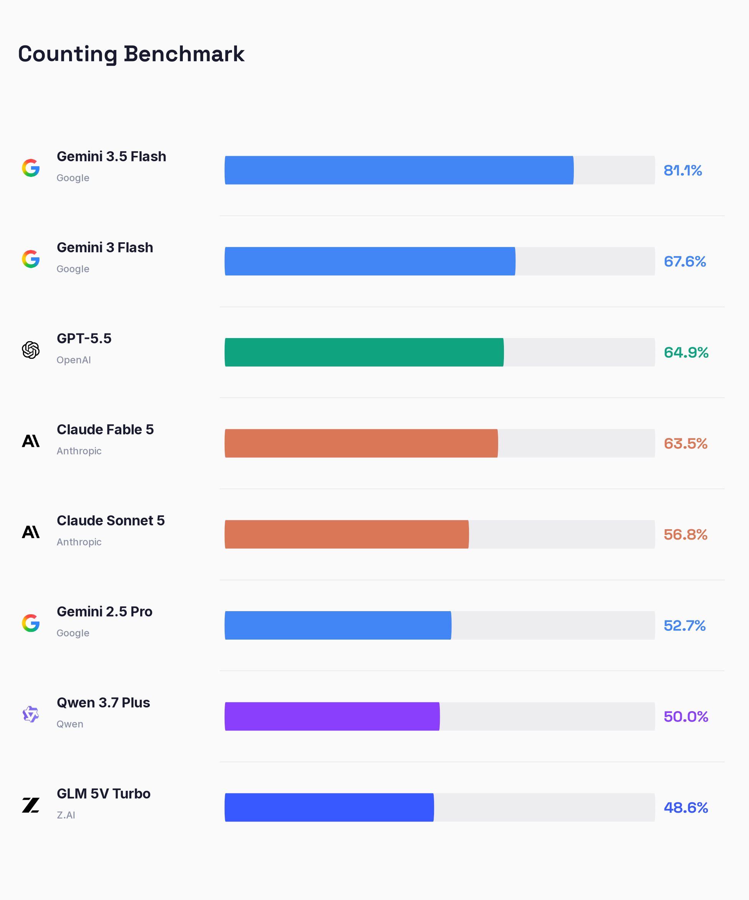
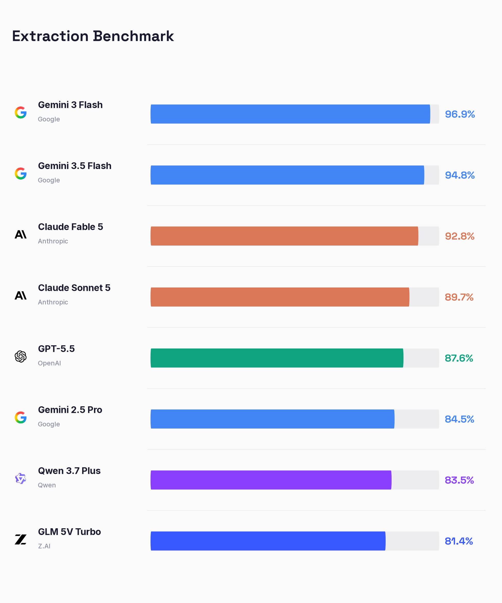
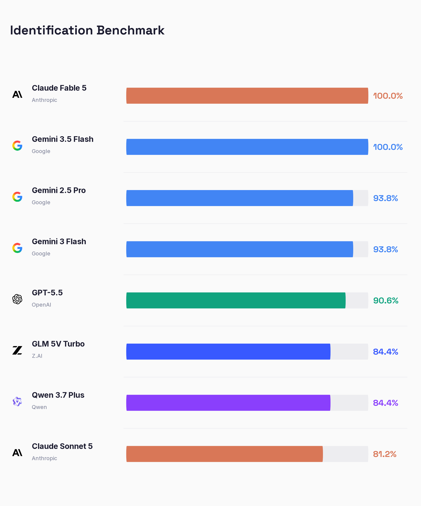
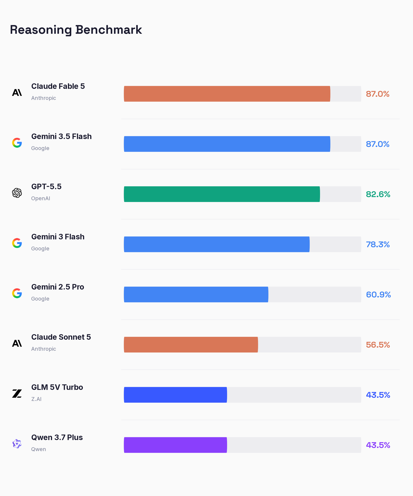
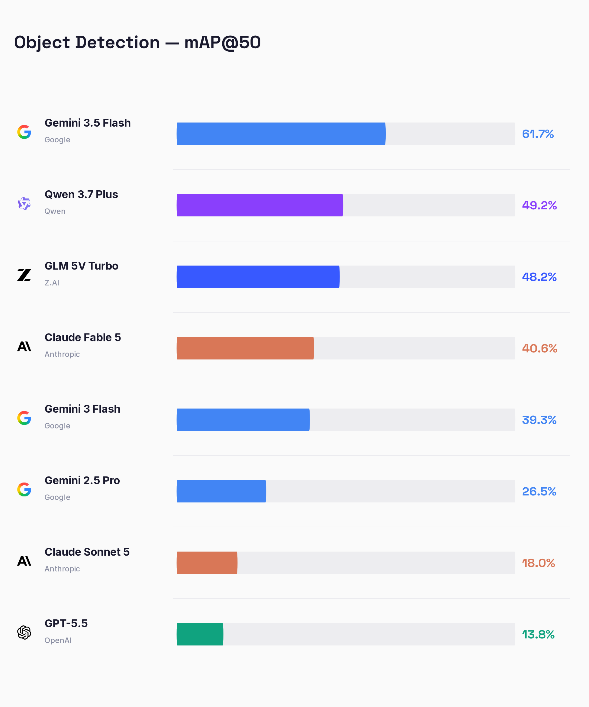

# vlm-exam

Benchmark suite for Vision Language Models. Compare accuracy, cost, and
speed across frontier VLMs on standardized visual tasks.

## Supported tasks

- **VQA / OCR** -- visual question answering and optical character recognition
- **Object Detection** -- bounding box prediction evaluated with COCO-style mAP

## Leaderboard

The `results/` directory holds the raw benchmark outputs (one JSONL file per
run) and is the single source of truth for the numbers below. Regenerate the
charts at any time with `vlm-exam leaderboard`.

### Counting



### Extraction



### Identification



### Reasoning



### Object Detection



Stricter IoU thresholds:
[mAP@75](visualizations/leaderboards/detection_map75_low.png) |
[mAP@50:95](visualizations/leaderboards/detection_map50_95_low.png)

## Supported providers

- Anthropic (Claude)
- Google (Gemini)
- OpenAI (GPT)
- OpenRouter (any OpenAI-compatible vision model, e.g. Qwen 3.7 Plus,
  GLM 5V Turbo)

## Installation

```bash
pip install vlm-exam
```

Or install from source:

```bash
git clone https://github.com/roboflow/vlm-exam.git
cd vlm-exam
pip install -e ".[dev]"
```

## Quick start

Set your API keys (or place them in a `.env` file):

```bash
export ANTHROPIC_API_KEY=...
export GOOGLE_API_KEY=...
export OPENAI_API_KEY=...
export OPENROUTER_API_KEY=...
```

### Run a VQA benchmark

Expects a dataset directory containing an `annotations.jsonl` file with
`image`, `prefix` (question), and `suffix` (answer) fields.

```bash
vlm-exam run \
    --task vqa \
    --models claude-fable-5,gemini-3.5-flash,gpt-5.5 \
    --effort high \
    --dataset-directory data/vqa/train
```

Use an LLM judge as a fallback when strict answer matching fails:

```bash
vlm-exam run \
    --task vqa \
    --models gpt-5.5 \
    --effort low \
    --dataset-directory data/vqa/train \
    --match-mode judge \
    --judge-model gemini-3.5-flash
```

### Run a detection benchmark

Expects a COCO-format dataset directory containing an
`_annotations.coco.json` file alongside the images.

```bash
vlm-exam run \
    --task detection \
    --models gemini-3.5-flash,gpt-5.5,claude-fable-5 \
    --effort low \
    --dataset-directory data/detection/train
```

Useful options:

- `--max-samples 10` limits the number of processed images (handy for smoke tests).
- `--prompt-classes image` (default) lists only the classes present in each
  image's ground truth; `--prompt-classes all` lists every dataset class.

### Summarize results

Accuracy, token usage, and cost tables across all saved runs:

```bash
vlm-exam report --results-directory results
```

Dataset-level mAP@50, mAP@75, and mAP@50:95 for detection runs:

```bash
vlm-exam detection-report \
    --results-directory results \
    --dataset-directory data/detection/train
```

### Visualize detection predictions

Side-by-side ground truth vs. prediction cards with per-image mAP@50:

```bash
vlm-exam detection-visualize \
    --results-file results/detection_gemini-3.5-flash_low_20260707_122136.jsonl \
    --dataset-directory data/detection/train \
    --output-directory visualizations/detection \
    --max-images 20
```

`--label-mode` controls box labeling: `labels` draws class names on the boxes,
`legend` draws boxes only with a color legend below the images, and `auto`
(default) picks based on label density.

### Generate leaderboards

Regenerates leaderboard charts for all locally saved runs (VQA accuracy plus
detection mAP@50 / mAP@75 / mAP@50:95 per effort level):

```bash
vlm-exam leaderboard \
    --results-directory results \
    --dataset-directory data/detection/train \
    --output-directory visualizations/leaderboards
```

### Python

```python
from vlm_exam import load_config, create_provider, create_task, run_benchmark

config = load_config()
task = create_task("vqa")
samples = task.load_samples("/path/to/vqa/dataset")
provider = create_provider("anthropic", model="claude-fable-5")

results = run_benchmark(task=task, provider=provider, samples=samples, effort="high")
```

## Configuration

Model definitions, pricing, and lab branding live in
`src/vlm_exam/configs/models.yaml`. Add a new model by editing this file --
no code changes required.

For OpenRouter models, set `provider: openrouter` and add a
`provider_model_id` with the OpenRouter slug (e.g. `qwen/qwen3.7-plus`);
the short YAML key is what appears in result filenames and leaderboards.
Detection prompts for OpenRouter models request `[x_min, y_min, x_max,
y_max]` boxes normalized to 0-1000, matching the native grounding format
of Qwen-VL and GLM-V.

## License

Apache 2.0. See [LICENSE](LICENSE).
