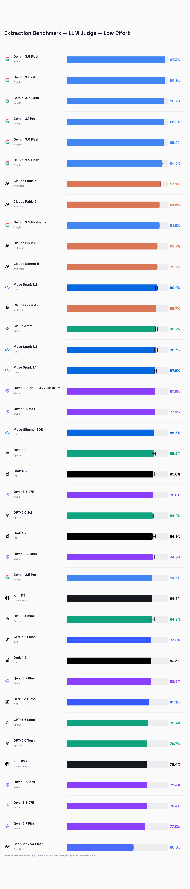

# vlm-exam

Benchmark suite for Vision Language Models. Compare accuracy, cost, and
speed across frontier VLMs on standardized visual tasks.

## Supported tasks

- **VQA / OCR** -- visual question answering and optical character recognition
- **Object Detection** -- bounding box prediction evaluated with COCO-style mAP

## Leaderboard

The `results/` directory holds the raw benchmark outputs (one JSONL file per
run) and is the single source of truth for the numbers below. Regenerate the
charts at any time with `vlm-exam leaderboard`.

The QA charts show LLM-judge accuracy; each links to the strict-match
variant of the same leaderboard. See "Run a VQA benchmark" below for how
the two metrics differ.

### Counting


[Strict-match variant](visualizations/leaderboards/counting_accuracy_strict_low.png)

### Extraction



[Strict-match variant](visualizations/leaderboards/extraction_accuracy_strict_low.png)

### Identification


[Strict-match variant](visualizations/leaderboards/identification_accuracy_strict_low.png)

### Reasoning


[Strict-match variant](visualizations/leaderboards/reasoning_accuracy_strict_low.png)

### Object Detection


Reference open-vocabulary detectors (YOLO-E, etc.) are benchmarked separately.
See [reference/README.md](reference/README.md) for setup and commands.

Stricter IoU thresholds:
[mAP@75](visualizations/leaderboards/detection_map75_low.png) |
[mAP@50:95](visualizations/leaderboards/detection_map50_95_low.png)

## Supported providers

- Anthropic (Claude)
- Google (Gemini)
- OpenAI (GPT)
- OpenRouter (any OpenAI-compatible vision model, e.g. Qwen3.7 Plus,
  GLM 5V Turbo)

## Installation

```bash
pip install vlm-exam
```

Or install from source:

```bash
git clone https://github.com/roboflow/vlm-exam.git
cd vlm-exam
pip install -e ".[dev]"
```

## Quick start

Set your API keys (or place them in a `.env` file):

```bash
export ANTHROPIC_API_KEY=...
export DASHSCOPE_API_KEY=...
export GOOGLE_API_KEY=...
export OPENAI_API_KEY=...
export OPENROUTER_API_KEY=...
export XAI_API_KEY=...
```

### Run a VQA benchmark

Expects a dataset directory containing an `annotations.jsonl` file with
`image`, `prefix` (question), and `suffix` (answer) fields.

```bash
vlm-exam run \
    --task vqa \
    --models claude-fable-5,gemini-3.5-flash,gpt-5.5 \
    --effort high \
    --dataset-directory data/vqa/train
```

Counting, extraction, identification, and reasoning are scored two ways at
once, and both numbers are reported for every model:

- **strict**: a deterministic rule (normalized exact match, or integer
  equality for counting). Measures correctness and format compliance.
- **judge**: an LLM judge (`gemini-3.5-flash`, temperature 0) scores every
  sample independently of the strict rule. Measures correctness while
  tolerating phrasing.

The judge runs automatically and needs `GOOGLE_API_KEY`; pick a different
judge model with `--judge-model`. The judge number is the headline on the
leaderboard charts and the website; the strict number is exported next to
it. A run whose stored predictions lack either verdict can be backfilled in
place without re-running the model:

```bash
vlm-exam rescore results/reasoning_gpt-5.5_low_20260725_101010.jsonl
```

### Repeat runs and average them

Every committed configuration is run three times and the leaderboards,
reports, and web summary report the mean over those runs. Repeats are just
result files: every file in `results/` with the same `(task, model, effort)`
counts as one run, so there is nothing to register. `--repeats` runs a
configuration back to back, `--concurrency` evaluates samples in parallel
within a run:

```bash
vlm-exam run \
    --task reasoning \
    --models claude-fable-5-1 \
    --effort low \
    --dataset-directory data/reasoning/train \
    --repeats 3 \
    --concurrency 4
```

Repeats may also be launched as separate processes writing to the same
directory; filenames are made unique on collision. `--resume-file <file>`
re-runs only the failed samples of a run, writes the merged complete file,
and deletes the source so the partial run is not counted as a repeat.

### Run a detection benchmark

Expects a COCO-format dataset directory containing an
`_annotations.coco.json` file alongside the images.

```bash
vlm-exam run \
    --task detection \
    --models gemini-3.5-flash,gpt-5.5,claude-fable-5 \
    --effort low \
    --dataset-directory data/detection/train
```

Useful options:

- `--max-samples 10` limits the number of processed images (handy for smoke tests).
- `--prompt-classes image` (default) lists only the classes present in each
  image's ground truth; `--prompt-classes all` lists every dataset class.

### Summarize results

Accuracy, token usage, and cost tables across all saved runs. Each row is
one `(task, model, effort)` configuration with its run count; metrics are
the mean over runs with half the min-max spread after `+/-`, and cost is
per run:

```bash
vlm-exam report --results-directory results
```

Dataset-level mAP@50, mAP@75, and mAP@50:95 for every detection run, with
the mean per configuration:

```bash
vlm-exam detection-report \
    --results-directory results \
    --dataset-directory data/detection/train
```

### Visualize detection predictions

Side-by-side ground truth vs. prediction cards with per-image mAP@50:

```bash
vlm-exam detection-visualize \
    --results-file results/detection_gemini-3.5-flash_low_20260721_114044.jsonl \
    --dataset-directory data/detection/train \
    --output-directory visualizations/detection \
    --max-images 20
```

`--label-mode` controls box labeling: `labels` draws class names on the boxes,
`boxes` draws boxes with a class color legend overlaid on the image (so colors
still map to class names when per-box labels would be too crowded), and `auto`
(default) picks between the two based on label density.

### Generate leaderboards

Regenerates leaderboard charts for all locally saved runs (VQA accuracy plus
detection mAP@50 / mAP@75 / mAP@50:95 per effort level). Bars show the mean
over a model's repeated runs; models with more than one run get a whisker
spanning their lowest and highest run. Use `--group <name>` or `--models`
to filter to a subset.

```bash
vlm-exam leaderboard \
    --results-directory results \
    --dataset-directory data/detection/train \
    --output-directory visualizations/leaderboards
```

### Compile a summary for the web

Compiles every run in `results/` into a single JSON payload for the
benchmark website, averaging the repeats of each `(task, effort, model)`
configuration. It carries per-task metadata and, for each model, its
per-task quality plus token spend, cost, and inference speed of one run.
Each entry is one `(model, effort)`
pair with a unique `id`, so the same model appears once per effort; the
top-level `efforts` array lists every effort present. Pass
`--dataset-directory` to include detection mAP (otherwise detection quality
metrics are omitted while its efficiency metrics are kept). Filter with
`--group <name>` or `--models`, and restrict to a single effort with
`--effort` (defaults to all efforts). The frontend supplies its own lab
logos and live pricing, so those are intentionally left out. The output is
deterministic: `generated_at` is derived from the newest included run, so
regenerating without new results produces a byte-identical file.

```bash
vlm-exam summary \
    --results-directory results \
    --dataset-directory data/detection/train \
    --output-file web/benchmark_summary.json
```

The output has this shape (abbreviated):

```json
{
  "generated_at": "2026-07-10T08:11:31Z",
  "efforts": ["low"],
  "scoring": {
    "judge_model": "gemini-3.5-flash",
    "judge_metric": "accuracy_judge",
    "strict_metric": "accuracy_strict"
  },
  "protocol": { "repeats": 3 },
  "tasks": [
    {
      "key": "ocr",
      "name": "OCR",
      "primary_metric": "similarity",
      "metrics": [
        { "key": "similarity", "label": "Mean Similarity", "unit": "percent" }
      ]
    },
    {
      "key": "detection",
      "name": "Detection",
      "primary_metric": "map50",
      "metrics": [
        { "key": "map50", "label": "mAP@50", "unit": "percent" },
        { "key": "map75", "label": "mAP@75", "unit": "percent" },
        { "key": "map50_95", "label": "mAP@50:95", "unit": "percent" }
      ]
    }
  ],
  "models": [
    {
      "id": "gpt-5.6-sol:low",
      "key": "gpt-5.6-sol",
      "name": "GPT-5.6 Sol",
      "lab": "openai",
      "effort": "low",
      "tasks": {
        "ocr": {
          "primary_metric": { "name": "similarity", "value": 90.73 },
          "metrics": { "similarity": 90.73 },
          "metric_runs": { "similarity": [90.1, 91.4, 90.69] },
          "run_count": 3,
          "timestamps": ["2026-07-10T06:02:10Z", "2026-07-10T06:48:57Z", "2026-07-10T07:33:33Z"],
          "sample_count": 37,
          "evaluated_sample_count": null,
          "failed_sample_count": 0,
          "tokens": { "input": 46626, "output": 31917, "total": 78543, "average_per_sample": 2122.8 },
          "cost": { "total_usd": 1.19064, "average_per_sample_usd": 0.032179 },
          "speed": { "total_seconds": 496.636, "average_seconds_per_sample": 13.423 },
          "timestamp": "2026-07-10T07:33:33Z"
        },
        "detection": {
          "primary_metric": { "name": "map50", "value": 46.23 },
          "metrics": { "map50": 46.23, "map75": 20.85, "map50_95": 23.26 },
          "metric_runs": { "map50": [46.23], "map75": [20.85], "map50_95": [23.26] },
          "run_count": 1,
          "timestamps": ["2026-07-09T21:50:44Z"],
          "sample_count": 250,
          "evaluated_sample_count": 250,
          "failed_sample_count": 0,
          "tokens": { "input": 629173, "output": 180400, "total": 809573, "average_per_sample": 3238.3 },
          "cost": { "total_usd": 8.557865, "average_per_sample_usd": 0.034231 },
          "speed": { "total_seconds": 3632.994, "average_seconds_per_sample": 14.532 },
          "timestamp": "2026-07-09T21:50:44Z"
        }
      },
      "overall": {
        "task_count": 6,
        "sample_count": 513,
        "tokens": { "input": 976102, "output": 237183, "total": 1213285, "average_per_sample": 2365.1 },
        "cost": { "total_usd": 11.996, "average_per_sample_usd": 0.023384 },
        "speed": { "total_seconds": 5094.531, "average_seconds_per_sample": 9.931 }
      }
    }
  ]
}
```

All quality metrics are percentages (0-100). QA tasks report
`accuracy_judge` (primary) and `accuracy_strict`, OCR reports `similarity`,
and detection reports `map50` (primary), `map75`, and `map50_95`. `metrics`
holds the mean over the configuration's runs, `metric_runs` the per-run
values behind each mean (oldest first, matching `timestamps`), and
`run_count` how many runs were averaged; `protocol.repeats` is the number
every committed configuration is expected to reach. Tokens, cost, and speed
describe one run (the mean over repeats); `failed_sample_count` is summed
over repeats. No-data contract: a task absent from a model's `tasks`
means the model was not benchmarked on it; `primary_metric: null` with
empty `metrics` means quality could not be computed (e.g. detection without
`--dataset-directory`) while efficiency numbers remain valid.
`evaluated_sample_count` is detection-only (null elsewhere): the number of
images the mAP was actually computed on, which should equal `sample_count`.
The `cost` numbers are estimates from token usage and the config's static
pricing; the site should recompute cost from its own live pricing feed.

### Python

```python
from vlm_exam import load_config, create_provider, create_task, run_benchmark

config = load_config()
task = create_task("vqa")
samples = task.load_samples("/path/to/vqa/dataset")
provider = create_provider("anthropic", model="claude-fable-5")

results = run_benchmark(task=task, provider=provider, samples=samples, effort="high")
```

## Configuration

Model definitions, pricing, lab branding, detection coordinate formats,
and optional fallback routes live in `src/vlm_exam/configs/models.yaml`.
Add a new model by editing this file -- no code changes required for
single-route models.

Each model must declare `detection_coordinate_format` for its native
grounding convention. Valid values are defined by
`DetectionCoordinateFormat` in `src/vlm_exam/tasks/detection.py`:
`yxyx_normalized_0_to_1000`, `xyxy_normalized_0_to_1000`,
`xyxy_normalized_0_to_100`, `xyxy_absolute_resized_image`,
`xyxy_absolute_original_image`, and `yxyx_absolute_original_image`.

For rate-limit resilience, list multiple `routes` in priority order.
`FallbackProvider` fails over on 429/quota errors and sticks to the next
route for the rest of the run. Example:

```yaml
  gemini-3.1-pro-preview:
    detection_coordinate_format: yxyx_normalized_0_to_1000
    routes:
      - provider: google
      - provider: openrouter
        provider_model_id: google/gemini-3.1-pro-preview
```

For OpenRouter-only models, set `provider: openrouter` (legacy syntax) or
a single `routes` entry, plus `provider_model_id` with the OpenRouter slug
(e.g. `qwen/qwen3-vl-235b-a22b-instruct`). The short YAML key appears in
result filenames and leaderboards.

## License

Apache 2.0. See [LICENSE](LICENSE).
